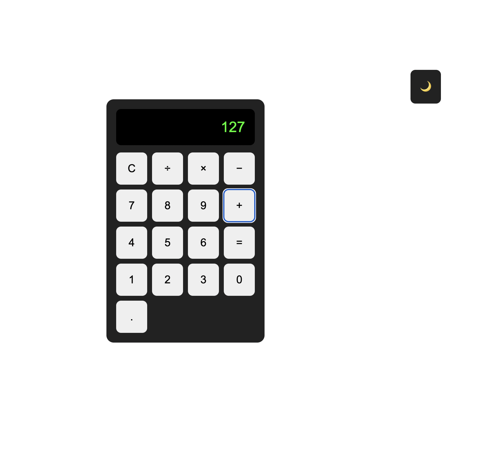
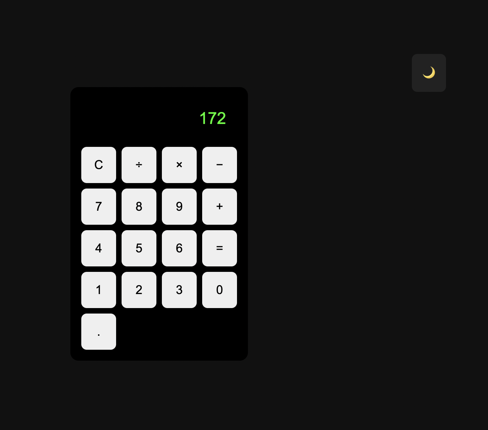

# Vanilla JavaScript Calculator

A fully functional calculator built with HTML, CSS, and Vanilla JavaScript, focused on clean state management, DOM manipulation, and real-world UI behavior.

This project was built to strengthen core JavaScript fundamentals without relying on frameworks.

---

# Features

- Basic arithmetic operations (+ − × ÷)
- Continuous calculations (chain operations)
- Decimal support with validation
- Keyboard support (numbers, operators, Enter, ESC)
- Click and keyboard input parity
- Display overflow handling
- Dark / Light mode toggle
- Clean, modular logic structure

---

# Keyboard Controls

| Key       | Action           |
| --------- | ---------------- |
| `0–9`     | Number input     |
| `.`       | Decimal          |
| `+ - * /` | Operators        |
| `Enter`   | Equals           |
| `Escape`  | Clear calculator |

---

# Built With

- HTML5
- CSS3 (Flexbox)
- Vanilla JavaScript

---

# 📸 Screenshots

# Light Mode

# Dark Mode

---

# What I Learned

- Managing application state without frameworks
- Handling user input from multiple sources (UI + keyboard)
- Writing predictable, maintainable DOM logic
- Implementing real-world calculator behavior
- Improving UX through accessibility and polish

---

# Possible Improvements

- Memory buttons (M+, M−, MR, MC)
- Operator precedence parsing
- Scientific calculator functions
- Conversion to React or Vue

---

# 🧑‍💻 Author

Mike Awoyemi
